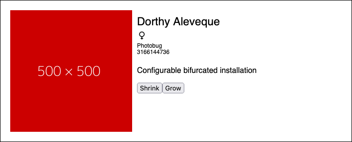

# Typescript task

## Cel zadania
Należy napisać oraz otypować (najlepiej w odwrotnej kolejności) funkcję która przekształci dane
z pliku `data.json` na komponent opowiedzialny za wyświetlenie tych danych w przeglądarce internetowej.

Komponent przyjmuje następujące parametry:

| nazwa         | wymagany | typ                                                                                                                                            | opis                               |
|---------------|----------|------------------------------------------------------------------------------------------------------------------------------------------------|------------------------------------|
| name          | *        | string                                                                                                                                         | imię użytkownika                   |
| pictureSource | *        | url                                                                                                                                            | link do jego zdjęcia               |
| occupation    | *        | string                                                                                                                                         | firma w której pracuje             |
| gender        | *        | `Male` lub `Female`                                                                                                                            | płeć                               |
| about         | *        | text                                                                                                                                           | krótki opis                        |
| size          | *        | `small`, `medium` lub `large`                                                                                                                  | rozmiar komponentu                 |
| onButtonClick | *        | funkcja która otrzymuje 2 parametry:<br/>`direction` - `shrink` lub `grow`<br/>`component` - cały div w którym mieści się pojedynczy komponent | fukncja przekazywana do przycisków |
| email         |          | adres email                                                                                                                                    | adres email użytkownika            |
| phone         |          | numer telefonu                                                                                                                                 | numer telefonu uzytkownika         |

### Przykładowo wyrenderowany komponent


## Jak wykonać zadanie?

Aby prawidłowo wykonać zadanie plik `src/index.ts` powinien wyeksportować domyślnie funkcję, która przyjmie jako 
parametr tablice wszystkich użytkowników i zwróci tablicę obiektów - takich których będzie można użyć do wyrenderowania
komponentów.

## Uruchomienie aplikacji w trybie developerskim
```shell
npm install
npm run dev
```
Aplikacja uruchomi serwer http z funkcją live-reload oraz będzie obserwować wszystkie pliki w katalogu src i na bieżąco
transpilować je z typescriptu na javascript.

Uruchomienie serwera powinno poskutkować automatycznym uruchomieniem przeglądarki. Jeżeli tak się nie stanie przejdź pod
adres [localhost:8080](http://localhost:8080)

Po otwarciu konsoli powinna pokazać się tabela z danymi wejściowymi do aplikacji.

## Dodatkowe punkty

1. Za napisanie funkcji odpowiadającej za zmianę rozmiaru komponentu (jak to zrobić - musisz przeanalizować kod w pliku `script.js` - nie modyfikuj tego pliku)
2. Napisanie funkcji sortującej - zanim funkcja `mapData` zwróci zmapowane dane powinna je posortować. Posortuj dane po imieniu, a następnie po nazwisku.

asdf
